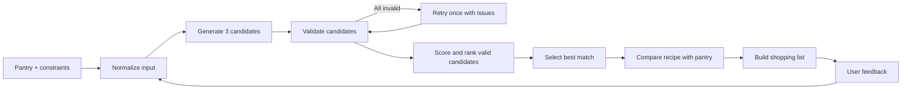

# AI Recipe & Pantry Agent

> A pantry-aware meal-planning assistant that turns household inventory and dietary constraints into validated, ranked recipes and an actionable shopping list.

**Portfolio snapshot:** working Streamlit MVP · structured LLM outputs · deterministic validation and ranking · 15 unit tests · 12 offline evaluation cases

This project is not a recipe chatbot. It is a focused decision workflow: understand the request, generate options, check constraints, rank valid choices, compare the winner with the pantry, and replan from feedback.

## Problem

Choosing what to cook means reconciling what is already at home, how much time is available, dietary requirements, dislikes, and missing groceries. Recipe search usually starts with a dish; general-purpose chat can suggest a dish but does not reliably validate it. The result is decision friction, unnecessary purchases, and unused food.

The product starts with the pantry and asks: **"Given what I already have, what should I cook?"**

## Target users

- Home cooks who want to use ingredients before buying more
- People planning around time, diet, allergy, or preference constraints
- Anyone turning a saved recipe into a pantry-aware shopping list

This is a consumer MVP and portfolio case study, not a medical, nutrition, or allergy-certification product.

## Core use cases

| Use case | Outcome |
|---|---|
| Cook From My Pantry | Enter pantry items and constraints, then receive a validated best match, alternatives, cooking steps, and missing ingredients. |
| Recipe → Shopping List | Paste recipe text, extract its ingredients, compare them with pantry inventory, and group items as available, partial, missing, or uncertain. |
| Replan from feedback | Ask for a faster, simpler, lighter, or ingredient-free alternative and run the workflow again with updated constraints. |

## Key features

- Structured recipe generation and recipe-text extraction with Pydantic models
- Hard checks for explicit allergens, dietary conflicts, cooking time, and recipe completeness
- Deterministic candidate ranking rather than LLM-selected "best" answers
- Alias normalization and quantity comparison across compatible mass, volume, and count units
- Explicit uncertainty when quantities, units, or broad ingredient names cannot be resolved safely
- One controlled regeneration attempt when every candidate fails validation
- A user-facing decision trace with validation outcomes and scores. It does not show hidden model reasoning.

## Why AI?

AI handles the parts that are difficult to express as fixed rules: generating coherent recipe candidates, extracting structure from loosely formatted recipe text, and interpreting qualitative feedback. Structured outputs turn those model responses into typed data that normal Python functions can inspect.

Normalization, allergy checks, unit comparison, shopping-list aggregation, scoring, and ranking remain deterministic because they need predictable and testable behavior.

## Why an agentic workflow instead of a chatbot?

A single prompt would collapse generation and selection into one opaque answer. This implementation uses one orchestrator to sequence specialized functions, observe structured results, reject invalid actions, retry once with validation feedback, and replan after user feedback.

That is the limited sense in which the workflow is agentic. It is not a general autonomous agent, and it does not use multiple agents, long-term memory, or unsupervised external actions.

## Product workflow



## Architecture

The model creates candidates. Deterministic code validates, compares, and ranks them.

| LLM responsibility | Deterministic responsibility |
|---|---|
| Generate three recipe candidates | Parse and normalize common pantry formats |
| Extract fields from pasted recipe text | Enforce allergy, diet, time, structure, and feasibility checks |
| Produce cooking instructions | Match ingredients and compare compatible quantities |
| Interpret open-ended feedback | Calculate pantry use, missing items, and weighted scores |
| Return Pydantic-compatible structured data | Rank candidates and aggregate the shopping list |

Major model outputs use Pydantic response schemas. Prompts live in `prompts/`; the OpenAI boundary retries invalid structured parsing once. The orchestrator then validates and ranks the typed objects without asking the model to choose the winner.

See [`docs/architecture.md`](docs/architecture.md) for module boundaries, state, retries, shopping-list flow, and the evaluation pipeline.

## Tech stack

- Python 3.11+
- Streamlit
- Pydantic
- OpenAI Python SDK
- python-dotenv
- pytest

## Example user journey

**Input**

```text
Pantry: 300g chicken breast, 4 eggs, 200g spinach, rice, mushrooms
Servings: 2
Maximum time: 30 minutes
Preference: high protein
Allergy: peanuts
```

**Workflow**

1. Pantry names, quantities, and units are normalized.
2. The model returns three typed recipe candidates.
3. Python rejects candidates that conflict with the allergy, diet, time limit, or minimum recipe requirements.
4. Valid candidates receive a weighted score based on pantry utilisation, missing ingredients, constraint fit, time, and simplicity.
5. The top recipe is compared with pantry quantities to produce available, top-up, missing, and uncertain groups.
6. Feedback such as "under 20 minutes" updates the constraint set and reruns the process.

## Evaluation approach

The offline evaluation isolates deterministic product behavior from model variability. It runs nine recommendation fixtures and three shopping-list fixtures without an API call. Recommendation fixtures include valid cases and expected rejections for vegan, keto, allergy, time-limit, and sparse-pantry conflicts.

| Metric | What it measures |
|---|---|
| Recipe validity accuracy | Whether validation agrees with each fixture’s expected valid/invalid label |
| Pantry utilisation | Share of relevant pantry ingredients used; salt, pepper, water, and generic oil are excluded |
| Constraint compliance | Share of allergy, diet, servings, and time checks satisfied by a candidate |
| Missing ingredient count | Number of required ingredients that are absent or need topping up |
| Shopping precision | Share of predicted purchases that are expected purchases |
| Shopping recall | Share of expected purchases found by the matcher |
| Shopping exact match | Share of shopping cases whose complete predicted set equals the expected set |

### Current offline results

Measured with `python -m evals.run_evals` on the checked-in 12-case fixture set:

| Metric | Result |
|---|---:|
| Recipe validity accuracy | 100% (9/9 fixtures) |
| Average pantry utilisation | 86.1% |
| Average constraint compliance | 86.1% |
| Average missing ingredient count | 0.44 |
| Shopping-list precision | 100% |
| Shopping-list recall | 100% |
| Shopping-list exact match | 100% (3/3 fixtures) |

These results describe a small, hand-authored offline set, not production performance or live-generation quality. No fixture mismatches are currently observed. Known failure modes appear as explicit uncertainty: unknown pantry quantities, incompatible units such as cups versus grams, ambiguous names such as "cream," and aliases outside the small built-in dictionary. Live model evaluation remains a future experiment; [`evals/experiments.md`](evals/experiments.md) intentionally contains no invented benchmark values.

## Testing

The 15 unit tests cover ingredient normalization, aliases, quantity conversion, incompatible units, allergy families, diet and time checks, ranking, partial purchases, shopping-list deduplication, and the one-retry orchestration path. They use a fake model client where needed and make no API calls.

```bash
pytest
python -m evals.run_evals
```

## Run locally

```bash
git clone <your-repository-url>
cd ai-recipe-pantry-agent
python3.11 -m venv .venv
source .venv/bin/activate          # Windows: .venv\Scripts\activate
pip install -r requirements.txt
cp .env.example .env
```

Add your key to `.env`:

```env
OPENAI_API_KEY=your-key-here
OPENAI_MODEL=gpt-4.1-mini
```

Start the app:

```bash
streamlit run app.py
```

The sidebar can also accept a key for the current browser session. The app does not persist it.

## Project structure

```text
.
├── app.py                     # Streamlit experience
├── src/                       # Models, orchestration, validation, matching, scoring
├── prompts/                   # Versioned prompts used by the model boundary
├── tests/                     # Offline unit tests
├── evals/                     # Fixed cases, runner, and experiment ledger
├── docs/
│   ├── architecture.md        # Technical design and data flow
│   └── portfolio_notes.md     # Resume and interview-ready framing
├── requirements.txt
├── .env.example
└── LICENSE
```

## Design decisions

- **One orchestrator, not multiple agents:** every tool shares the same short-lived pantry and constraint state; extra agents would add coordination cost without independent work.
- **Rules after generation:** model output is a candidate, never an automatic recommendation.
- **One retry only:** validation feedback gets one regeneration attempt, preventing unbounded loops and cost.
- **Small alias map:** enough to demonstrate normalization while making its limits visible.
- **No database:** Streamlit session state is sufficient for an MVP and keeps local setup simple.
- **No nutrition claims:** reliable nutrition requires a verified external data source that is outside this MVP.

## Demo screenshots to capture

No screenshots are committed yet. Capture these at a desktop width of roughly 1440 px after running the app with realistic sample data:

| Filename | Capture |
|---|---|
| `docs/images/best-match.png` | The completed "Cook From My Pantry" result showing the five metric cards and pantry check. |
| `docs/images/decision-trace.png` | The same result with "How the Agent Decided" expanded, including a rejected candidate if available. |
| `docs/images/shopping-list.png` | The "Recipe → Shopping List" result showing recognised ingredients and all available, top-up, and buy columns. |

Embed the three files under this section after capture.

## Limitations

- No persistent pantry, household profile, authentication, or grocery integration
- No OCR, image input, recipe URL parsing, or recipe retrieval system
- Limited ingredient aliases and unit conversion; no density-based conversions
- No verified nutrition or calorie database
- Allergy matching is a guardrail, not medical assurance or cross-contamination detection
- Offline fixtures test deterministic logic; live LLM quality has not been benchmarked

## Future iterations

1. Evaluate live generation across repeated model runs and log constraint failures separately.
2. Add expiry-aware pantry prioritisation and persistent inventory.
3. Integrate a verified nutrition or recipe data source before adding nutrition claims.
4. Add weekly planning and grocery export only after validating the two core workflows with users.

## What I learned

- Generative output becomes more credible when typed, validated, and scored outside the model.
- "Uncertain" is a useful product state; it is safer than fabricating quantities or forcing a match.
- Evaluation needs separate views of model quality and deterministic logic so failures are attributable.
- Agentic product value can come from a small controlled loop, not from adding an orchestration framework.

Interview and resume framing is available in [`docs/portfolio_notes.md`](docs/portfolio_notes.md).
