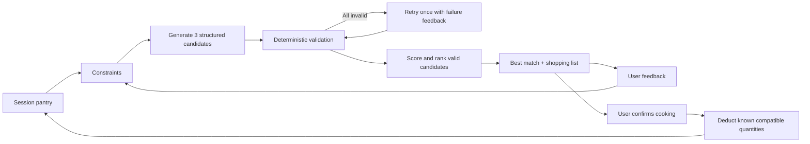

# Personal Food Decision Agent

> A pantry-aware AI product that helps users decide what to cook, adapts to feedback, and turns recipe decisions into pantry and shopping actions.

**Portfolio snapshot:** working Streamlit MVP · structured LLM output · deterministic validation/ranking · session pantry state · feedback replanning · 20 automated tests · 12 offline evaluation cases

## Problem

People often have food at home but still struggle with a simple recurring decision: **what should I cook today?** The decision becomes harder when time, dietary constraints, dislikes, ingredient quantities and missing groceries all need to be considered together.

Most recipe search products start from a dish. A general chatbot can generate ideas, but it does not reliably validate hard constraints or maintain a usable inventory state.

This project starts from the pantry.

## Product scope

The MVP prioritises three connected journeys:

| Journey | Outcome |
|---|---|
| Pantry state | Keep and edit household inventory during the browser session. |
| Cook From My Pantry | Generate recipe candidates, validate constraints, rank the valid options and identify missing ingredients. |
| Recipe → Shopping List | Parse a pasted recipe and compare it with current pantry quantities. |

After the user cooks the selected recipe, known compatible quantities can be deducted from the session pantry. Users can also give feedback such as “under 20 minutes” or “no mushrooms” and re-run the workflow with updated constraints.

## Why AI?

The LLM handles ambiguous language tasks:

- generating coherent recipe candidates
- extracting structure from pasted recipe text
- interpreting qualitative feedback

Deterministic Python handles the parts that need predictable behavior:

- allergy and diet checks
- cooking-time validation
- pantry feasibility
- ingredient aliases and compatible unit conversion
- candidate scoring and ranking
- shopping-list aggregation
- inventory deduction

The model proposes. Code validates and decides.

## Agent workflow



This is a deliberately narrow agentic workflow rather than a general autonomous agent.

## Iteration 2

The second product iteration focused on three gaps in the first MVP.

### 1. Pantry state

The first version treated pantry input as a one-off field. Iteration 2 keeps inventory in Streamlit session state and lets the user edit or add ingredients.

After cooking, the app deducts recipe quantities only when both the recipe and pantry have known, safely comparable quantities.

### 2. Feedback-driven replanning

The workflow inherits the latest constraints and can update them from feedback such as:

- “under 20 minutes”
- “vegetarian instead”
- “no mushrooms”
- “fewer ingredients”

### 3. Failure taxonomy

Aggregate accuracy alone does not explain why an AI workflow fails. Validation failures are now classified into stable product categories:

- allergy conflict
- diet conflict
- dislike conflict
- time limit
- structural failure
- pantry feasibility
- other

See [docs/product_iteration_2.md](docs/product_iteration_2.md).

## Evaluation

The offline suite intentionally separates deterministic product behavior from live model variability.

Current checked-in results on 12 fixed fixtures:

| Metric | Result |
|---|---:|
| Recipe validity accuracy | 100% |
| Average pantry utilisation | 86.1% |
| Average constraint compliance | 86.1% |
| Average missing ingredient count | 0.44 |
| Shopping precision | 100% |
| Shopping recall | 100% |
| Shopping exact match | 100% |

The suite also reports the distribution of validation failures by taxonomy.

These are small offline fixture results, **not** production or live-model benchmarks.

## Testing

The project now contains 20 automated tests covering:

- ingredient normalization and aliases
- quantity conversion and uncertainty
- allergy, diet and time validation
- scoring and ranking
- shopping-list aggregation
- retry behavior
- feedback interpretation
- pantry state merging and consumption
- failure taxonomy

Run:

```bash
pytest
python -m evals.run_evals
```

## Tech stack

- Python
- Streamlit
- Pydantic
- OpenAI Python SDK
- pytest

## Run locally

```bash
git clone https://github.com/iate-o/what-to-eat-agent.git
cd what-to-eat-agent
python3.11 -m venv .venv
source .venv/bin/activate
pip install -r requirements.txt
cp .env.example .env
```

Add:

```env
OPENAI_API_KEY=your-key-here
OPENAI_MODEL=gpt-4.1-mini
```

Then:

```bash
streamlit run app.py
```

## Product decisions

- **One orchestrator, not multiple agents.** All tools share the same pantry, constraints and candidate state, so additional agents would add coordination cost without clear product value.
- **Rules after generation.** Generated recipes are proposals and must pass deterministic validation before they can be selected.
- **One retry only.** A single retry limits latency and cost while still allowing the workflow to recover from invalid candidates.
- **Explicit uncertainty.** Unknown quantities or incompatible units are marked uncertain rather than converted with invented assumptions.
- **Session state before database persistence.** The MVP validates the inventory concept without adding authentication or infrastructure before user value is proven.

## Limitations

- Pantry state is session-only and does not persist across devices.
- Ingredient aliases and unit conversion are intentionally limited.
- No verified nutrition database is used.
- Allergy matching is a product guardrail, not medical assurance.
- Live LLM quality has not yet been benchmarked with repeated controlled runs.

## Next iteration

The next experiment is a controlled live-generation evaluation using a pinned model and prompt version. The goal is to measure hard-constraint failures, compare prompt/workflow changes on the same case set, and separate model-quality issues from deterministic product logic.

Interview and resume framing is documented in [docs/portfolio_notes.md](docs/portfolio_notes.md).
