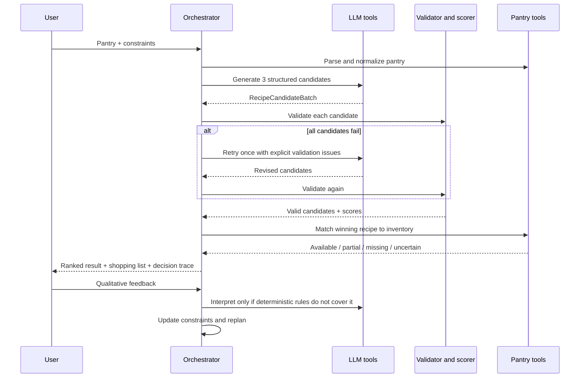
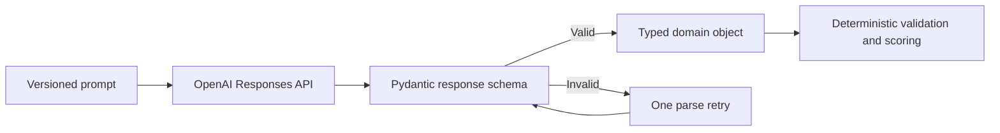
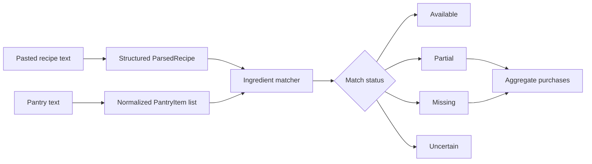
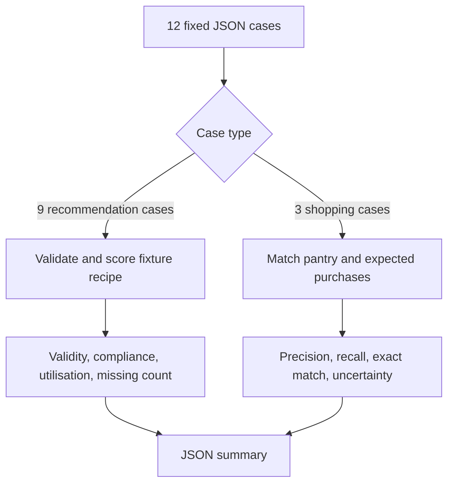

# Architecture

## Design thesis

The system is a pantry-aware decision agent, not a recipe generator. Model output is treated as a proposal. Deterministic code decides whether a proposal is safe, suitable, and useful.

## End-to-end workflow



There is no unbounded loop. Candidate generation gets at most one retry when every candidate fails.

## Module responsibilities

| Module | Responsibility |
|---|---|
| `models.py` | Pydantic contracts used at every boundary |
| `pantry.py` | Line parsing, aliases, plural cleanup, ambiguity flags, unit normalization |
| `ingredient_matcher.py` | Name matching and safe conversion within mass, volume, or count families |
| `llm_client.py` | OpenAI SDK boundary, prompt loading, structured parsing, one parse retry |
| `recipe_generator.py` | Candidate prompt and post-response normalization |
| `recipe_parser.py` | Extraction from pasted recipe text and incomplete-input warnings |
| `validator.py` | Allergy, diet, time, structure, dislike, and pantry-feasibility gates |
| `scorer.py` | Pantry utilisation, weighted score, complexity band, and ranking |
| `shopping_list.py` | Status grouping, top-up calculation, and duplicate aggregation |
| `feedback.py` | Common deterministic feedback rules plus structured LLM fallback |
| `orchestrator.py` | Workflow order, retry policy, selection, and public decision trace |
| `app.py` | Session state and the two user workflows |

## Core data contracts

- `PantryItem` preserves the original and normalized name, optional quantity/unit, and ambiguity flag.
- `UserConstraints` contains servings, time, diets, allergies, dislikes, and notes.
- `RecipeCandidate` is the model-generated proposal: ingredients, timing, tags, and steps.
- `ValidationResult` exposes individual hard-gate booleans and user-readable issues.
- `IngredientMatch` records the requirement, pantry match, status, quantities, confidence, and note.
- `RecipeScore` records each metric and the final 0 to 100 score.
- `CookResult` is the UI-facing aggregate: winner, alternatives, rejected candidates, shopping list, pantry, constraints, and trace.

## Structured output flow

The OpenAI boundary is deliberately narrow:



`llm_client.py` loads the prompt, requests a schema-backed response, and returns a Pydantic model. Recipe generation returns `RecipeCandidateBatch`; recipe extraction returns `ParsedRecipe`; open-ended feedback returns `FeedbackUpdate`. Model prose does not cross into ranking or quantity calculations without first becoming validated structured data.

## Pantry state

There is no database. Pantry input and workflow results live in Streamlit session state for the browser session:

- The raw pantry text is kept so feedback can trigger a full replan.
- Parsed `PantryItem` objects are recreated for each workflow run.
- The latest `CookResult` or parsed shopping-list result is held temporarily for rendering.
- API keys entered in the sidebar are passed to the client for that run and are not written by the app.

This keeps the MVP easy to clone and avoids implying inventory persistence that does not exist.

## Recipe generation flow

1. `parse_pantry` converts newline- or comma-separated input into normalized items.
2. `recipe_generator` sends pantry items and `UserConstraints` to the model and receives up to three typed candidates.
3. `validator` checks each candidate against explicit allergens, diet, dislikes, time, structure, and pantry feasibility.
4. If every candidate fails, the orchestrator passes the observed validation issues into one final generation attempt.
5. `scorer` ranks only valid candidates. The top result is selected without an LLM ranking call.
6. The winner's ingredient matches produce the shopping list and user-facing decision trace.

## Shopping-list generation flow



Shopping-list generation is deterministic after extraction. Duplicate missing ingredients are aggregated only when their normalized names and units match. Incompatible units and unknown quantities remain uncertain rather than being converted with an invented assumption.

## Deterministic safety boundary

Allergies, diet exclusions, time, structural validity, and pantry feasibility are checked after generation. Invalid candidates cannot be selected, regardless of how convincing their prose is.

The allergy matcher is intentionally conservative but not a clinical ontology. It catches explicit normalized ingredient terms (for example, `peanut` within `peanut oil`). Production use would require a maintained allergen taxonomy, packaging data, and cross-contamination handling.

## Ingredient matching and uncertainty

The matcher follows four states:

| State | Meaning |
|---|---|
| Available | The name matches and the known compatible quantity is enough, or the recipe only requires presence. |
| Partially available | Compatible units can be converted and the pantry amount is short. |
| Missing | No normalized name match exists. |
| Uncertain | An ingredient is ambiguous, a quantity is unknown, or the unit families cannot be compared. |

Only mass-to-mass, volume-to-volume, and count-to-count conversions are attempted. The system does not convert a cup of spinach to grams because ingredient density is unknown. It never fabricates a missing quantity.

## Scoring

Scoring runs only after validation. The current formula is:

```text
40% pantry utilisation
25% missing-ingredient score
20% constraint compliance
10% cooking-time fit
 5% simplicity
```

The explicit weights make the product policy reviewable and testable. They can be changed based on real product evidence without retraining or rewriting prompts.

## Retry and fallback behavior

- Structured model parsing is attempted twice: the initial call plus one retry.
- When all recipe candidates fail validation, the orchestrator sends their explicit issues into one new generation call.
- When the second batch also fails, the UI explains the blocking constraints rather than returning an unsafe recipe.
- API and parse errors become a friendly `LLMError`; they do not crash the app.
- Empty pantry or recipe input is rejected before an API call.
- Incomplete pasted recipes retain extracted information and show warnings.

## Why one agent

A multi-agent architecture was intentionally rejected for the MVP:

- Every tool operates on the same pantry, constraint, and candidate state.
- There is no meaningful independent collaboration that requires separate goals or memory.
- Deterministic functions are safer and cheaper than asking another agent to validate or rank.
- Additional agents would add latency, token cost, state synchronization, and debugging complexity without proportionate user value.

The single orchestrator still demonstrates agentic decomposition: it chooses and sequences modular tools, observes their structured outputs, retries after validation failure, and replans from user feedback.

## Evaluation boundary

Offline tests and fixtures evaluate the deterministic layer separately from model quality. This makes failures attributable. Live prompt experiments should hold the case set and model snapshot constant, log hard-constraint failures individually, and record results in `evals/experiments.md`. Real user satisfaction remains unmeasured until the product collects it.



The checked-in evaluation does not call the model. It measures the deterministic safety and comparison layer. Live generation reliability is a separate future experiment because model sampling, model version, and prompt version must be controlled and reported together.
